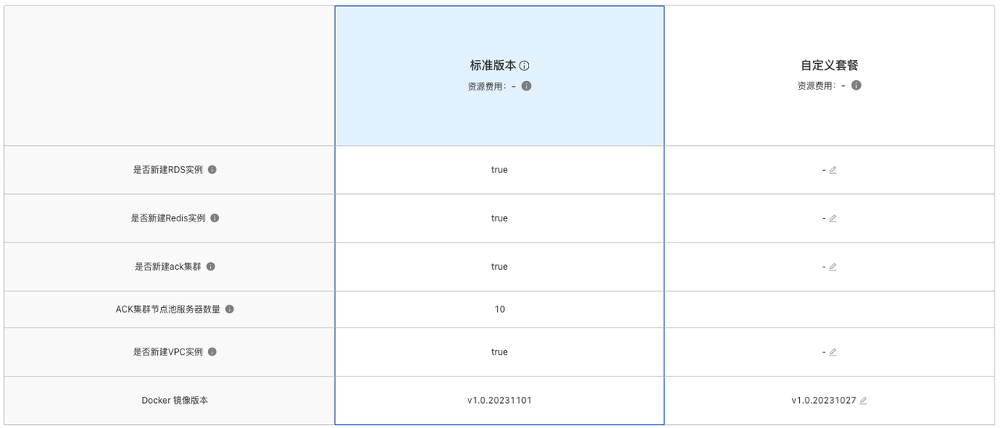
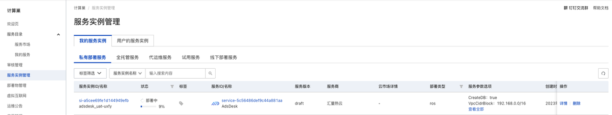
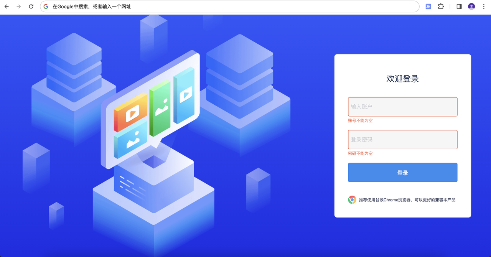

# AdsDesk 服务私有化一键部署文档

## 1、阿里云一键部署说明
在阿里云只需在创建页选配好云服务器参数，阿里计算巢将自动为您创建带有AdsDesk的云服务器。

创建完成后，您只需将自己的域名与服务集群内的LB地址绑定即可使用AdsDesk。

## 2、需要权限列举

| 权限策略名称 | 备注 |
| --- | --- |
| AliyunCSDefaultRole | 容器服务(CS)在集群操作时默认使用此角色来访问您在其他云产品中的资源 |
| AliyunCSManagedVKRole | 容器服务(CS) Serverless集群VK组件使用此角色来访问您在其他云产品中的资源。 |
| AliyunCSManagedKubernetesRole | 容器服务(CS) Managed Kubernetes版 默认使用此角色来访问您在其他云产品中的资源 |
| AliyunCSManagedLogRole | 容器服务(CS) Kubernetes 集群日志组件使用此角色来访问您在其他云产品中的资源 |
| AliyunCSManagedCmsRole | 容器服务(CS) 集群CMS组件使用此角色来访问您在其他云产品中的资源。 |
| AliyunCSManagedCsiRole | 容器服务(CS) Kubernetes 集群存储插件使用此角色来访问您在其他云产品中的资源 |
| AliyunCSKubernetesAuditRole | 容器服务(CS) Kubernetes 审计功能使用此角色来访问您在其他云产品中的资源 |
| AliyunCSManagedNetworkRole | 容器服务(CS) 集群网络组件使用此角色来访问您在其他云产品中的资源。 |
| AliyunCSManagedArmsRole | 容器服务(CS) Kubernetes 集群Arms插件使用此角色来访问您在其他云产品中的资源。 |
| AliyunCSServerlessKubernetesRole | 容器服务(CS) Serverless Kubernetes版 默认使用此角色来访问您在其他云产品中的资源 |

其次，由于AdsDesk底层调用了大数据能力，因此还需要您提前准备 Access Key 和 Access Secret，为大数据能力的EMR-Spark和EMR-Flink提供授权支持。@杜苏康 补充AKSK分配方法

## 3、阿里云一键部署具体步骤

| 操作步骤 | 描述说明 |
| --- | --- |
| 向服务商申请授权 | 向服务商申请，为AliUid授权访问和部署。 |
| 为RAM用户的账号 | 非主账号使用时，对使用的RAM用户的账号添加相应资源的权限。 |
| 选择套餐版本 | 根据预估投放广告的活跃账号数，选配IT资源的套餐版本。 |
| 配置部署参数 | 配置部署服务的实例、账户密码和系统参数。 |
| 订单确认 | 进入订单确认页面，检查权限依赖、确认服务信息和预览价格，并勾选“我已阅读并同意《计算巢服务协议》”中的复选框。 |

选择快捷设定“标准版本”，将默认为您创建能够支撑大约300活跃账号服务集群的RDS、Redis、ACK、Flink、Sprack等实例资源，并自动在ACK的节点池中配置资源10台机型为ecs.g7.xlarge的服务。

## 4、交付物 
查看服务实例：服务实例创建成功后，部署时间需要大约30分钟。立即创建后，页面上可以看到对应的服务实例，如下图

## 5、客户使用
通过浏览器访问AdsDesk登录页

更多功能请参考 [AdsDesk 操作手册](https://www.kancloud.cn/must7bingo/must7bingo/2733398)
